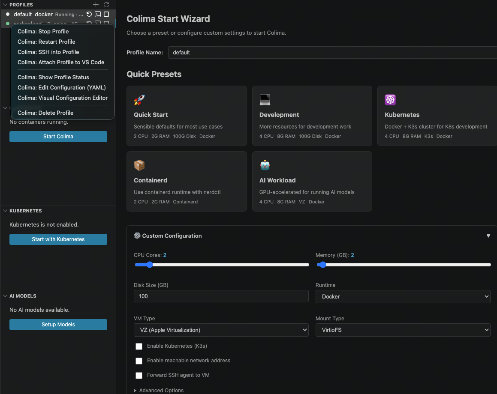

# 🐳 Colima for VS Code

**[English](#english) | [中文](#中文)**

---

<a id="english"></a>

## English

> **The easiest way to manage Colima container runtimes — right from your editor. Works on macOS, Linux, and Windows (via WSL).**

[Colima](https://github.com/abiosoft/colima) provides container runtimes on macOS and Linux with minimal setup. This extension brings Colima's full power into VS Code with a beautiful, intuitive GUI — no more memorizing CLI commands.



[](https://github.com/song-chaoyang/colima-vscode/actions/workflows/ci.yml)
[](https://opensource.org/licenses/MIT)

### ✨ Features

#### 🚀 One-Click Start & Stop
- **Start Wizard** with 5 quick presets: Quick Start, Development, Kubernetes, Containerd, AI Workload
- **Custom Configuration** form with CPU/memory sliders, runtime selectors, Kubernetes toggle, environment variables, and more
- One-click **Start / Stop / Restart / Delete** from the status bar or sidebar

#### 📊 Live Monitoring Dashboard
- **Profiles Tree** — All Colima instances with status (running/stopped/broken), CPU, memory, disk, and runtime
- **Containers Tree** — Docker containers with image, status, ports. Right-click to Stop, Restart, Remove, Logs, Exec, Inspect
- **Kubernetes Tree** — Pods grouped by namespace with status, readiness, restart count, and age
- **AI Models Tree** — List pulled AI models with one-click Run or Serve

#### 🔗 Attach to VS Code (Remote-SSH Integration)
- Right-click a running profile → **"Attach to VS Code"**
- Opens a new VS Code window connected to the Colima VM via SSH
- File explorer shows the VM's filesystem — just like WSL or Docker Dev Containers
- Full remote development experience: edit files, run terminals, install extensions on the VM

#### ⚙️ Visual Configuration Editor
- Edit `colima.yaml` with a beautiful form-based UI — no YAML syntax to remember
- Automatically detects and marks immutable settings (arch, runtime, vmType, mountType) as read-only
- Sections: Resources, Runtime, Kubernetes, Network, Advanced

#### 🌍 Multi-Language Support (i18n)
- 🇬🇧 **English** and 🇨🇳 **中文** — automatically follows your VS Code language setting
- All UI text, notifications, progress messages, and error messages are localized

#### ☸️ Kubernetes Management
- Start, Stop, Reset, and Delete Kubernetes clusters
- Browse pods grouped by namespace

#### 🤖 AI Model Management
- Pull, Run, and Serve AI models from HuggingFace, Ollama, and Docker AI Registry

#### 🖥️ Integrated Terminal
- SSH into Colima VM with a single click
- Docker shell with proper socket configuration
- View container logs, exec into containers, inspect containers — all in VS Code terminals

### 📸 Screenshots

#### Start Wizard with Presets
The start wizard provides 5 one-click presets and a custom configuration form:
- 🚀 **Quick Start** — 2 CPU, 2GB RAM, Docker (sensible defaults)
- 💻 **Development** — 4 CPU, 8GB RAM, Docker (more resources)
- ☸️ **Kubernetes** — Docker + K3s cluster
- 📦 **Containerd** — Containerd runtime with nerdctl
- 🤖 **AI Workload** — Optimized for AI model workloads

#### Sidebar Dashboard
Four panels in the activity bar:
- **Profiles** — Manage all Colima instances with right-click context menu
- **Containers** — View and manage Docker containers
- **Kubernetes** — Browse K8s pods grouped by namespace
- **AI Models** — Manage pulled AI models

#### Status Bar
Real-time Colima state at the bottom of VS Code:
- Shows active profile name, CPU cores, and memory
- Color-coded: green (running), yellow (broken), red (error)
- Click for quick actions menu

#### Attach to VS Code
Right-click a running profile → "Attach to VS Code":
1. Extension automatically configures SSH connection
2. Opens a new VS Code window connected to the VM
3. File explorer shows VM's filesystem (`/home/user.guest`)
4. Terminal is SSH'd into the VM
5. Install extensions directly on the VM

### 🚀 Quick Start

1. **Install Colima** (if you haven't already):
   ```bash
   brew install colima
   ```

2. **Install this extension** from the VS Code Marketplace

3. **Click the Colima icon** 🐳 in the Activity Bar (left sidebar)

4. **Click "Start Colima"** and choose a preset, or configure custom settings

5. **Run Docker commands** — Colima sets up your Docker context automatically!

### 📋 Commands

| Command | Description |
|---------|-------------|
| `Colima: Start` | Open the visual start wizard |
| `Colima: Quick Start` | Start with defaults (2 CPU, 2GB, Docker) |
| `Colima: Start (Development Preset)` | 4 CPU, 8GB RAM, Docker |
| `Colima: Start (Kubernetes Preset)` | Docker + K3s cluster |
| `Colima: Start (Containerd Preset)` | Containerd runtime |
| `Colima: Start (AI Workload Preset)` | Optimized for AI model workloads |
| `Colima: Stop` | Stop a Colima instance (graceful or force) |
| `Colima: Restart` | Restart a Colima instance |
| `Colima: Delete Instance` | Delete with data cleanup option |
| `Colima: Attach to VS Code` | Open remote VS Code window connected to VM |
| `Colima: SSH into VM` | Open SSH terminal to the VM |
| `Colima: Show Status` | Detailed status in a webview panel |
| `Colima: Edit Configuration` | Visual YAML config editor |
| `Colima: Create/Switch Profile` | Manage multiple instances |
| `Colima: Start/Stop/Reset/Delete Kubernetes` | K8s cluster management |
| `Colima: Pull/Run/Serve AI Model` | AI model management |
| `Colima: Update Container Runtime` | Update Docker/containerd |
| `Colima: Prune Cache` | Clean cached download assets |

### ⚙️ Settings

| Setting | Default | Description |
|---------|---------|-------------|
| `colima.colimaPath` | `""` | Path to colima binary (auto-detected if empty) |
| `colima.autoRefresh` | `true` | Automatically refresh status and tree views |
| `colima.refreshInterval` | `10` | Refresh interval in seconds (5-120) |
| `colima.defaultProfile` | `"default"` | Default Colima profile name |
| `colima.showStatusBarItem` | `true` | Show the status bar item |
| `colima.verboseLogging` | `false` | Enable verbose logging in output channel |

### ⌨️ Keyboard Shortcuts

| Shortcut | Action |
|----------|--------|
| `Ctrl+Shift+C S` / `Cmd+Shift+C S` | Quick Start Colima |
| `Ctrl+Shift+C X` / `Cmd+Shift+C X` | Stop Colima |

### 📦 Requirements

- [Colima](https://colima.run/docs/installation/) installed on your machine
- macOS (recommended) or Linux
- [Docker CLI](https://docs.docker.com/get-docker/) (for container management features)
- [kubectl](https://kubernetes.io/docs/tasks/tools/) (for Kubernetes features, install with `brew install kubectl`)
- [Remote-SSH extension](https://marketplace.visualstudio.com/items?itemName=ms-vscode-remote.remote-ssh) (for "Attach to VS Code" feature)

---

<a id="中文"></a>

## 中文

> **在 VS Code 中轻松管理 Colima 容器运行时 — 告别命令行！支持 macOS、Linux 和 Windows (通过 WSL)。**


[Colima](https://github.com/abiosoft/colima) 是 macOS 和 Linux 上的轻量级容器运行时管理工具。本插件将 Colima 的全部功能集成到 VS Code 中，提供直观的图形界面 — 无需再记忆命令行参数。

### ✨ 功能特性

#### 🚀 一键启动与停止
- **启动向导** 包含 5 个快速预设：快速启动、开发环境、Kubernetes、Containerd、AI 工作负载
- **自定义配置** 表单：CPU/内存滑块、运行时选择器、Kubernetes 开关、环境变量编辑器等
- 从状态栏或侧边栏一键 **启动 / 停止 / 重启 / 删除**

#### 📊 实时监控面板
- **配置实例树** — 显示所有 Colima 实例的状态（运行中/已停止/异常）、CPU、内存、磁盘和运行时
- **容器树** — Docker 容器列表，显示镜像、状态、端口映射。右键可停止、重启、移除、查看日志、进入终端、检查详情
- **Kubernetes 树** — 按命名空间分组的 Pod 列表，显示状态、就绪状态、重启次数、存活时间
- **AI 模型树** — 列出已拉取的 AI 模型，一键运行或提供服务

#### 🔗 附加到 VS Code（Remote-SSH 集成）
- 右键运行中的实例 → **"附加到 VS Code"**
- 自动打开新的 VS Code 窗口，通过 SSH 连接到 Colima 虚拟机
- 资源管理器显示虚拟机的文件系统 — 就像 WSL 或 Docker Dev Containers 一样
- 完整的远程开发体验：编辑文件、运行终端、在虚拟机上安装扩展

#### ⚙️ 可视化配置编辑器
- 使用美观的表单界面编辑 `colima.yaml` — 无需记忆 YAML 语法
- 自动检测并标记不可变设置（架构、运行时、虚拟机类型、挂载类型）为只读
- 分区：资源、运行时、Kubernetes、网络、高级

#### 🌍 多语言支持
- 🇬🇧 **英文** 和 🇨🇳 **中文** — 自动跟随 VS Code 语言设置
- 所有界面文本、通知、进度消息和错误消息均已本地化

#### ☸️ Kubernetes 管理
- 启动、停止、重置和删除 Kubernetes 集群
- 按命名空间分组浏览 Pod

#### 🤖 AI 模型管理
- 从 HuggingFace、Ollama 和 Docker AI Registry 拉取、运行和服务 AI 模型

#### 🖥️ 集成终端
- 一键 SSH 进入 Colima 虚拟机
- 配置好 Docker socket 的 Docker shell
- 查看容器日志、进入容器终端、检查容器 — 全部在 VS Code 终端中完成

### 📸 功能截图说明

#### 启动向导
启动向导提供 5 个一键预设和自定义配置表单：
- 🚀 **快速启动** — 2 CPU、2GB 内存、Docker（默认配置）
- 💻 **开发环境** — 4 CPU、8GB 内存、Docker（更多资源）
- ☸️ **Kubernetes** — Docker + K3s 集群
- 📦 **Containerd** — Containerd 运行时 + nerdctl
- 🤖 **AI 工作负载** — 为 AI 模型工作负载优化

**使用方式**：`Cmd+Shift+P` → 输入 `Colima: Start` → 选择预设或自定义配置 → 点击"启动 Colima"

#### 侧边栏面板
活动栏中的四个面板：
- **配置实例** — 管理所有 Colima 实例，右键打开上下文菜单（启动/停止/重启/SSH/附加/编辑配置/删除）
- **容器** — 查看和管理 Docker 容器（右键：停止/重启/移除/日志/终端/检查）
- **Kubernetes** — 按命名空间分组浏览 K8s Pod
- **AI 模型** — 管理已拉取的 AI 模型

#### 状态栏
VS Code 底部的实时 Colima 状态指示器：
- 显示当前实例名称、CPU 核心数和内存大小
- 颜色标识：绿色（运行中）、黄色（异常）、红色（错误）
- 点击打开快捷操作菜单

#### 附加到 VS Code
右键运行中的实例 → "附加到 VS Code"：
1. 插件自动配置 SSH 连接（写入 `~/.ssh/config`）
2. 打开新的 VS Code 窗口，连接到虚拟机
3. 资源管理器显示虚拟机文件系统（如 `/home/chaoyang.guest`）
4. 终端已 SSH 进入虚拟机
5. 可以在虚拟机上安装扩展

**前提条件**：需安装 [Remote-SSH 扩展](https://marketplace.visualstudio.com/items?itemName=ms-vscode-remote.remote-ssh)

### 🚀 快速开始

1. **安装 Colima**（如果尚未安装）：
   ```bash
   brew install colima
   ```

2. 从 VS Code 插件市场**安装本插件**

3. **点击左侧活动栏的 Colima 图标** 🐳

4. **点击"启动 Colima"**，选择预设或自定义配置

5. **使用 Docker 命令** — Colima 会自动配置 Docker 上下文！

### 📋 命令列表

| 命令 | 说明 |
|------|------|
| `Colima: Start` | 打开可视化启动向导 |
| `Colima: Quick Start` | 使用默认配置启动（2 CPU、2GB、Docker） |
| `Colima: Start (Development Preset)` | 开发环境预设（4 CPU、8GB） |
| `Colima: Start (Kubernetes Preset)` | Docker + K3s 集群 |
| `Colima: Start (Containerd Preset)` | Containerd 运行时 |
| `Colima: Start (AI Workload Preset)` | AI 工作负载优化 |
| `Colima: Stop` | 停止实例（优雅停止或强制停止） |
| `Colima: Restart` | 重启实例 |
| `Colima: Delete Instance` | 删除实例（可选是否删除数据） |
| `Colima: Attach to VS Code` | 打开远程 VS Code 窗口连接到虚拟机 |
| `Colima: SSH into VM` | SSH 终端进入虚拟机 |
| `Colima: Show Status` | 在面板中显示详细状态 |
| `Colima: Edit Configuration` | 可视化 YAML 配置编辑器 |
| `Colima: Create/Switch Profile` | 创建/切换实例 |
| `Colima: Start/Stop/Reset/Delete Kubernetes` | K8s 集群管理 |
| `Colima: Pull/Run/Serve AI Model` | AI 模型管理 |
| `Colima: Update Container Runtime` | 更新 Docker/containerd |
| `Colima: Prune Cache` | 清理缓存资源 |

### ⚙️ 设置项

| 设置 | 默认值 | 说明 |
|------|--------|------|
| `colima.colimaPath` | `""` | colima 二进制文件路径（留空则自动检测） |
| `colima.autoRefresh` | `true` | 自动刷新状态和树视图 |
| `colima.refreshInterval` | `10` | 刷新间隔（秒，5-120） |
| `colima.defaultProfile` | `"default"` | 默认 Colima 实例名称 |
| `colima.showStatusBarItem` | `true` | 是否显示状态栏项 |
| `colima.verboseLogging` | `false` | 启用详细日志输出 |

### ⌨️ 快捷键

| 快捷键 | 操作 |
|--------|------|
| `Ctrl+Shift+C S` / `Cmd+Shift+C S` | 快速启动 Colima |
| `Ctrl+Shift+C X` / `Cmd+Shift+C X` | 停止 Colima |

### 📦 环境要求

- 已安装 [Colima](https://colima.run/docs/installation/)
- macOS（推荐）或 Linux
- [Docker CLI](https://docs.docker.com/get-docker/)（用于容器管理功能）
- [kubectl](https://kubernetes.io/docs/tasks/tools/)（用于 Kubernetes 功能，可通过 `brew install kubectl` 安装）
- [Remote-SSH 扩展](https://marketplace.visualstudio.com/items?itemName=ms-vscode-remote.remote-ssh)（用于"附加到 VS Code"功能）

### 📄 开源协议

MIT

### 🔗 相关链接

- [Colima GitHub](https://github.com/abiosoft/colima)
- [Colima 文档](https://colima.run/docs/)
- [问题反馈](https://github.com/song-chaoyang/colima-vscode/issues)
